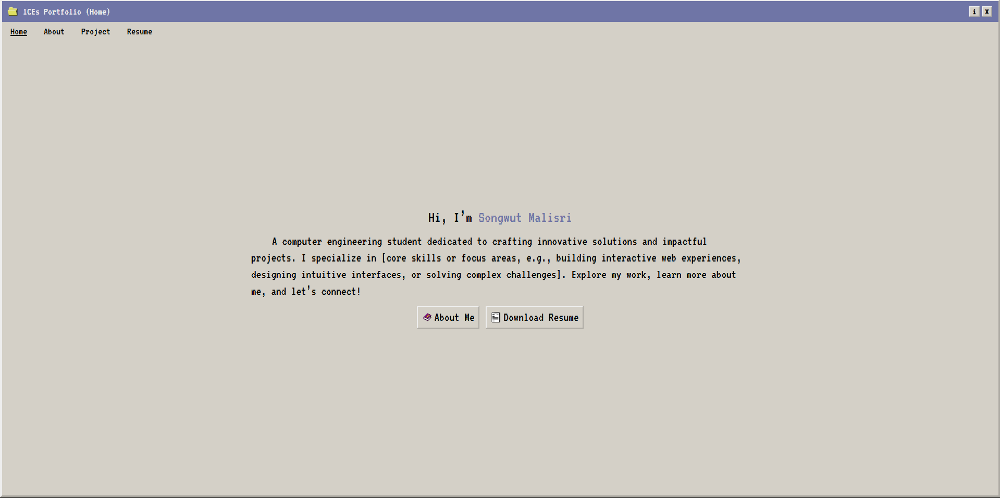

# Hi, this is my Portfolio Website! 🌟

Welcome to my portfolio repository! This project showcases my work, skills, and passion for [your field, e.g., web development, UI/UX design]. Built with **Vite**, **React**, and powered by **Bun.js**, this website is designed to be fast, modern, and scalable.

---

## 🚀 Technologies Used

- **Vite**: A fast build tool and development server.
- **React**: For building dynamic and interactive user interfaces.
- **Bun.js**: A modern JavaScript runtime for faster bundling and server-side rendering.
- **CSS/SCSS** or **TailwindCSS**: (mention your styling approach)
- [Add any additional tools or libraries used]

---

## 🖥️ Features

- **Responsive Design**: Works seamlessly on all devices.
- **Dynamic Content**: Projects, blogs, and interactive elements.
- **Fast Load Times**: Leveraging Vite's and Bun.js's performance optimizations.
- **Custom Animations**: Smooth and modern transitions.

---